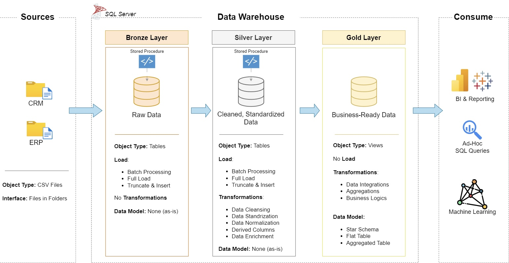

# sql_data_warehouse_project

Welcome to the **Data Warehouse and Analytics Project** repository 🚀!
This project demonstrates a comprehensive data warehousing and analytics solution, from building a data warehouse to generating actionable insights. Designed as a portfolio project, it highlights industry best practices in data engineering and analytics.

---
## 🏗️ Data Architecture

The data architecture for this project follows Medallion Architecture **Bronze**, **Silver**, and **Gold** layers:


1. **Bronze Layer**: Stores raw data as-is from the source systems. Data is ingested from CSV Files into SQL Server Database.
2. **Silver Layer**: This layer includes data cleansing, standardization, and normalization processes to prepare data for analysis.
3. **Gold Layer**: Houses business-ready data modeled into a star schema required for reporting and analytics.

---
## 📖 Project Overview

This project involves:

1. **Data Architecture**: Designing a Modern Data Warehouse Using Medallion Architecture **Bronze**, **Silver**, and **Gold** layers.
2. **ETL Pipelines**: Extracting, transforming, and loading data from source systems into the warehouse.
3. **Data Modeling**: Developing fact and dimension tables optimized for analytical queries.

## 🚀 Project Requirements

### Building the Data Warehouse (Data Engineering)

#### Objective

Develop a modern data warehouse using SQL Server to consolidate sales data, enabling analytical reporting and informed decision-making.

#### Specifications

- **Data Sources**: Import data from two source systems (ERP and CRM) provided as CSV files.
- **Data Quality**: Cleanse and resolve data quality issues prior to analysis.
- **Integration**: Combine both sources into a single, user-friendly data model designed for analytical queries.
- **Scope**: Focus on the latest dataset only; historization of data is not required.
- **Documentation**: Provide clear documentation of the data model to support both business stakeholders and analytics teams.

---

### BI: Analytics & Reporting (Data Analytics)

#### Objective

Develop SQL-based analytics to deliver detailed insights into:

- **Customer Behavior**
- **Product Performance**
- **Sales Trends**

These insights empower stakeholders with key business metrics, enabling strategic decision-making.

---
# 📂 Repository Structure
```
data-warehouse-project/
│
├── datasets/                           # Raw datasets used for the project (ERP and CRM data)
│
├── docs/                               # Project documentation and architecture details
│   ├── data_architecture.jpg           # Picture shows the project's architecture
│   ├── data_catalog.md                 # Catalog of datasets, including field descriptions and metadata
│   ├── data_flow.jpg                   # Picture for the data flow diagram
│   ├── data_model.jpg                  # Picture for data models (star schema)
│   ├── naming-conventions.md           # Consistent naming guidelines for tables, columns, and files
│
├── scripts/                            # SQL scripts for ETL and transformations
│   ├── bronze/                         # Scripts for extracting and loading raw data
│   ├── silver/                         # Scripts for cleaning and transforming data
│   ├── gold/                           # Scripts for creating analytical models
│
├── tests/                              # Test scripts and quality files
│
├── README.md                           # Project overview and instructions
├── LICENSE                             # License information for the repository
├── .gitignore                          # Files and directories to be ignored by Git
└── requirements.txt                    # Dependencies and requirements for the project
```
---
## 📍 License

This project is licensed under the [MIT License](LICENSE). You are free to use, modify, and share this project with proper attribution.

---
## 👋 About Me 

Hi! I'm **Ade Agung Nurbagus**, a **Business & Data Analyst** with over **4 years of experience** in logistics, manufacturing, and business process improvement.
I enjoy transforming raw data into actionable insights using **SQL, Tableau, Power BI, and Excel**.

My work focuses on designing end-to-end analytics solutions—from data extraction and transformation to interactive dashboards that support business decisions and operational improvements.

This GitHub is my portfolio, where I share data analytics projects, dashboard development, SQL solutions, and business intelligence case studies. I'm continuously expanding my expertise in data analytics, data modeling, and business intelligence. 

### 🛠️ Tech Stack
- 📊 SQL (SQL Server, MySQL)
- 📈 Tableau
- 📉 Power BI
- 📑 Microsoft Excel (Power Query & Power Pivot)
- 🏗️ Data Modeling & ETL
- 🚛 Supply Chain & Logistics Analytics
- ⚙️ Business Process Improvement & Continuous Improvement

### 🎯 Current Focus
- Building end-to-end Business Intelligence projects
- Developing interactive dashboards with Tableau & Power BI
- Strengthening SQL for Data Analytics
- Expanding my portfolio with real-world business case studies

### 📌 What You'll Find Here
- 🗄️ SQL Data Warehouse Project
- 🔄 ETL & Data Modeling

Thanks for visiting my GitHub! Feel free to explore my repositories and connect with me on the following platforms:


[](https://linkedin.com/in/ade-agung-nurbagus)
